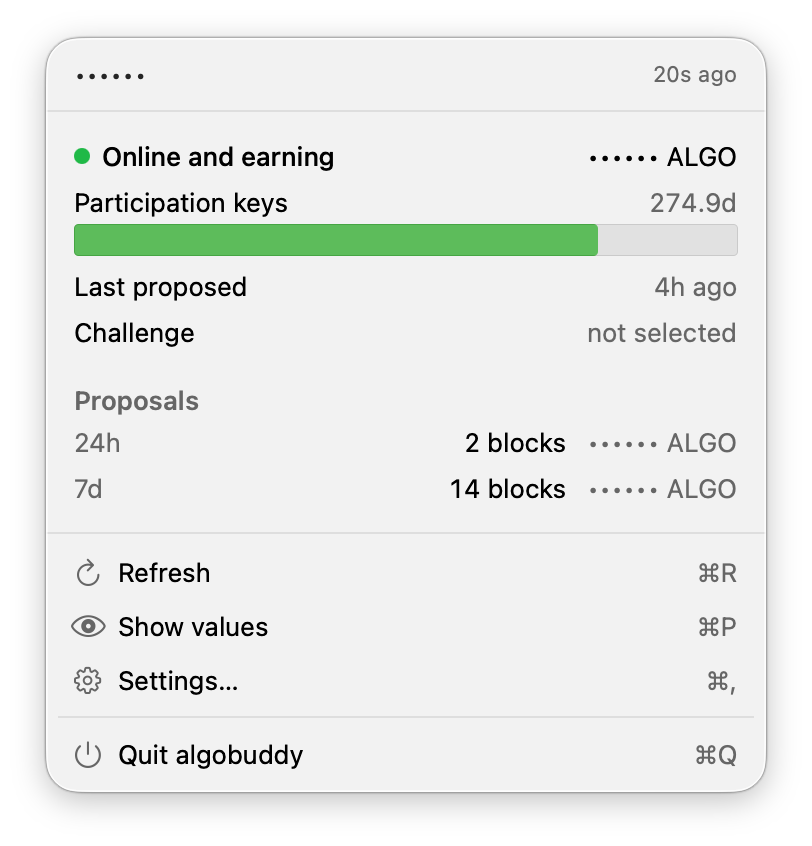

<p align="center">
  
</p>

<h1 align="center">algobuddy</h1>

A macOS menu bar app that watches an Algorand participation account and warns you before it costs you money.

**No node access. No token. No credentials of any kind.** Paste an address and it works, because everything it shows is public chain data.

<p align="center">
  
</p>

## What it watches

- **Participation keys**: countdown to `vote-last-valid`, warning at 14 days
- **Heartbeat challenge**: every 1000 rounds roughly 1 online account in 32 is challenged and must prove liveness within ~9 minutes. algobuddy computes this locally from the block seed and your address, and alerts if you're failing one
- **Absenteeism**: how much silence the protocol allows before suspension
- **Eligibility**: Online but not incentive-eligible, or a balance outside the 30,000 to 70M ALGO payout window
- **Proposals and payouts**: blocks and ALGO over 24h and 7d

## Install

Requires **macOS 14 or later** and a Swift 6 toolchain (`xcode-select --install` if you've never built anything).

```bash
git clone https://github.com/mrcointreau/algobuddy.git
cd algobuddy
make install
```

That compiles on your machine and installs to `/Applications`. Building locally means Gatekeeper never gets involved: the quarantine attribute is only applied to downloaded files.

Then open it, paste an Algorand address, and optionally tick **Open at login** in Settings.

## Updating

```bash
cd algobuddy
git pull
make install
```

That quits the running app, rebuilds from the new source, and reinstalls; open it again from `/Applications`. Your settings survive. Because every build carries a fresh ad-hoc signature, macOS may ask for notification permission again after an update.

## Uninstall

If you ticked **Open at login**, untick it first: only the app itself can withdraw that registration, so doing it afterwards means clearing a leftover entry in System Settings instead.

```bash
make uninstall   # quits it and removes the app, keeping your settings
make purge       # the same, and also forgets the address and settings
```

## Configuration

Everything lives in Settings (⌘,):

- **Account**: the address to watch
- **Menu bar**: which metrics to show, with a live width estimate. A wide menu bar item isn't shortened on a notched display, it's hidden entirely
- **Chain data source**: algod and indexer URLs, defaulting to a public provider. Point them at your own node if you'd rather not have a third party see which address you watch
- **Notifications**: on by default

## What it deliberately doesn't do

- **Connect to your node.** Not over SSH, a tunnel, a VPN, or an exposed endpoint. It never asks you to change `config.json` or install anything on the machine running algod.
- **Hold keys.** It signs nothing and submits nothing.
- **Store secrets.** There are none to store.

The cost is that it can't tell you your node is down until the chain notices, which in practice is the next challenge, roughly a day. The benefit is that installing it risks nothing.

## Licence

MIT. See [LICENSE](LICENSE).
